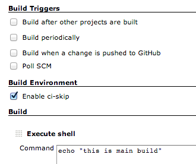

# Jenkins ci skip plugin

[](https://travis-ci.org/banyan/jenkins-ci-skip-plugin)

Skip making a build for certain push. Just add `[ci skip]` into your commit's message to let Jenkins know, that you do not want to perform build for the next push.

Full example:

```
$ git commit -m 'documentation update [ci skip]'
```

It is very useful when you are working things unrelated to application's code such as README. This feature idea comes from [Travis CI](http://about.travis-ci.org/docs/user/how-to-skip-a-build/).

## Installation

Install the plugin from the Jenkins Plugin Manager.

### Enabling ci-skip

In the job configuration, check Enable ci-skip.



## Development

```
$ bundle install
$ ./bin/start-jenkins
$ open http://localhost:8080
```

### Run Test

```
$ bundle exec rake
```

## Changelog

### Version 0.0.1 (Dec 21, 2013)

* initial release


[](https://bitdeli.com/free "Bitdeli Badge")

